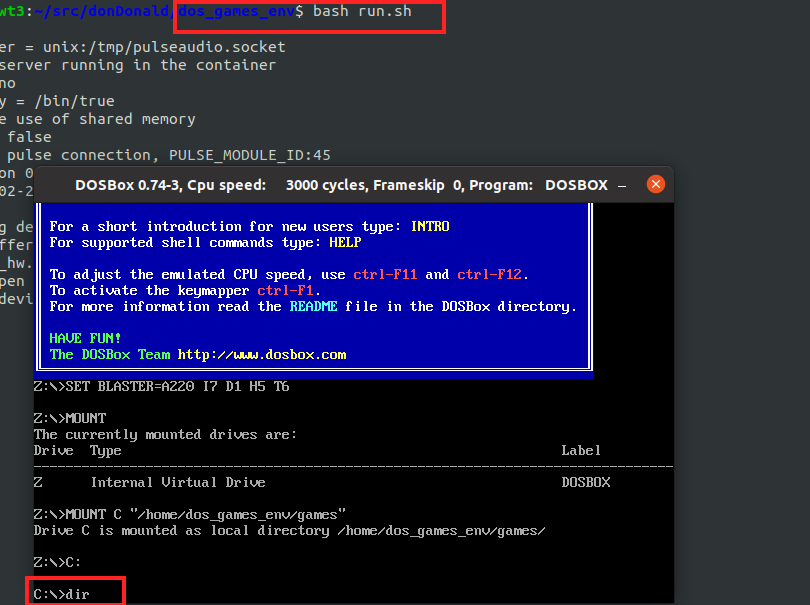
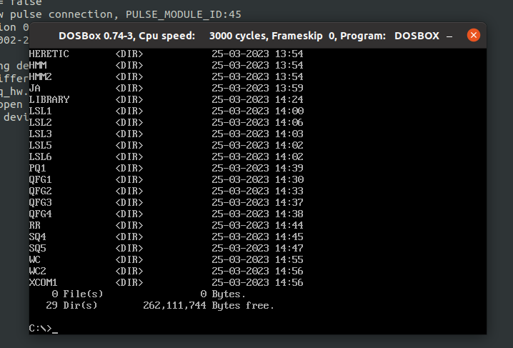
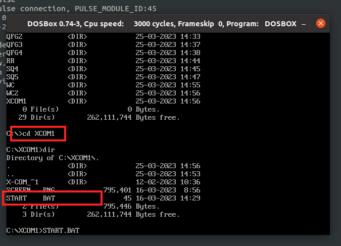
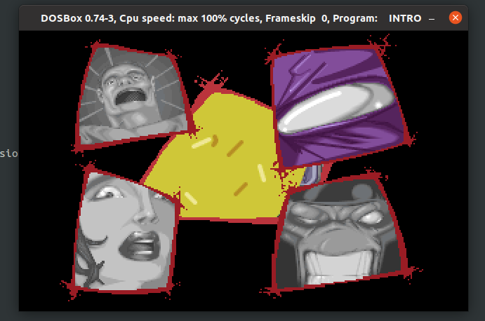

<div align="center">
    
</div>

# Intro
dosbox environtment for launching old dos games
Supported hosts OSes:
* Ubuntu 20.04
* Ubuntu 24.04


### To build DOSBOX image
```
bash ./build.sh
```


### To run DOSBOX image
```
bash ./run.sh
```


### To launch a game (let say XCOM1)


#### Launch the container
```
bash ./run.sh
```
<p align="center">
    
</p>


#### type ***dir*** command to see the list of the games
<p align="center">
    
</p>


#### Go to the game folder with ***cd*** command like ***cd XCOM1***
<p align="center">
    
</p>


#### launch the game with ***START.BAT***
<p align="center">
    
</p>


### List of tested and working games
* Blood
* Doom
* Doom2 (Hell on Earth)
* DUKE3D (Duke Nukem 3D)
* Heretic
* RR (Redneck Rampage)
* Full Throttle (ENG & RU)
* Gobliins2 (Gobliins2: The Prince Buffoon)
* LSL1 (Leisure Suit Larry in the Land of the Lounge Lizards) (ENG and RU)
* LSL2 (Leisure Suit Larry Goes Looking for Love (In Several Wrong Places))
* LSL3 (Leisure Suit Larry III: Passionate Patti in Pursuit of the Pulsating Pectorals)
* LSL5 (Leisure Suit Larry 5: Passionate Patti Does a Little Undercover Work)
* LSL6 (Leisure Suit Larry 6: Shape Up or Slip Out!)
* QfG1 (Quest for Glory I: So You Want to Be a Hero)
* QfG2 (Quest for Glory II: Trial by Fire)
* QfG3 (Quest for Glory III: Wages of War)
* QfG4 (Quest for Glory IV: Shadows of Darkness)
* SQ4 (Space Quest IV: Roger Wilco and the Time Rippers)
* SQ5 (Space Quest V: The Next Mutation) (ENG and RU)
* WC (WarCraft Orcs and Humans)
* WC2 EN (WarCraft\ II_\ Tides_of Darkness.v 1 3.Eng)   (here was an issue with storing audio configs, check screenshots)
* WC2 RU SPK (Warcraft 2 Tides Of Darkness Russian from СПК)
* XCOM1 (X-Com UFO Defense)
* HMM (Heroes of Might and Magic)
* HMM2 (Heroes of Might and Magic 2)
* JA (Jagged Alliance)
* PQ1 (Police Quest: In Pursuit of the Death Angel (VGA))

Note that every folder has ***START.BAT*** script for running all the games the same manner.


### To run bash in case you want to see what's going on in DOSBOX container
```
bash ./run.sh dos_games_env --entrypoint="/home/dos_games_env/bash.sh"
```


### Dosbox hotkeys
* Ctrl + F1    - Show the keymapper configuration screen
* Ctrl + Enter - Toggle full-screen mode
* Ctrl + F10   - Capture/Release the mouse (if you need to use the mouse within DOSBox)
* Ctrl + F9    - Kill (close) DOSBox


### Video setup


#### Ubuntu 20.04
For Ubuntu 20.04 current solution expectes that host system has X11.\
X forwarding is already setup this way:
* .Xauthority and /tmp/.X11-unix:/ are mounted into container.
* DISPLAY is assigned for SDK container

Have to enable access to hosts' X server to let X apps running on hosts's DISPLAY by running
```
$ xhost +local:
```

To test that X11 forwarding works as expected, run this:
```
bash ./run.sh dos_games_env.20.04 --entrypoint="xeyes"
```
You shall see xeyes popping up on the screen.


#### Ubuntu 24.04
For Ubuntu 24.04 current solution expectes Wayland.\
* DISPLAY is assigned for SDK container
To test that X11 forwarding works as expected, run this:
```
bash ./run.sh dos_games_env.24.04 --entrypoint="xeyes"
```
You shall see xeyes popping up on the screen.


### Sound setup


#### Ubuntu 20.04
For Ubuntu 20.04 current solution expectes that host system has pulseaudio.\
To test that sound forwarding works as expected, run this:

```
bash ./run.sh dos_games_env.20.04 --entrypoint="/home/dos_games_env/test_sound.sh"
```
You shall see some traces and hear some sounds being played actually by docker container.


#### Ubuntu 24.04
For Ubuntu 24.04 current solution expectes that host system has pipewire.\
To test that sound forwarding works as expected, run this:

```
bash ./run.sh dos_games_env.24.04 --entrypoint="/home/dos_games_env/test_sound.sh"
```
You shall see some traces and hear some sounds being played actually by docker container.


##### Ordinary game sound setup
I found these setting in www:
```
    https://www.dosbox.com/faq.php
    The game doesn't detect the soundbaster.
        Does the game have some setup/soundset/install or similar tool to setup your sound? Use that.
        The default settings for the ***soundblaster are, port 220, irq 7, dma 1***.
        Some games may also require you to slow down cpu emulation to detect the sound blaster correctly. 
```

and tested the next setup with Blood[https://en.wikipedia.org/wiki/Blood_(video_game)] game for DOS from 1997

    Sound Card
        - card: Sound Blaster
        - port: 0x220
        - irq:  7
        - 8-bit DMA: 1
        - 16-bit DMA: 5

    Music Card {
        - card: Sound Blaster

And ***Blood*** was running with both sound and music.\
Btw, ***Blood*** uses (Voxels)[https://en.wikipedia.org/wiki/Voxel] for drawing keys and other stuff, while Maincraft uses voxels for drawing the entire world.


### Notes


#### Library
Here is a thing I call ***Library*** containing game binaries.\
For obvious reason I can't publish those ones.\
Every game folder contains a link to that binaries, and therefore the binaries shall be owned by you.
